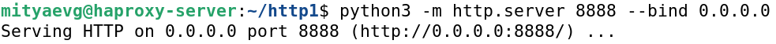
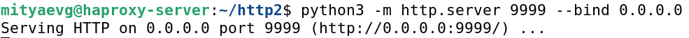
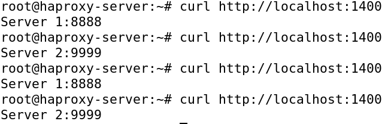
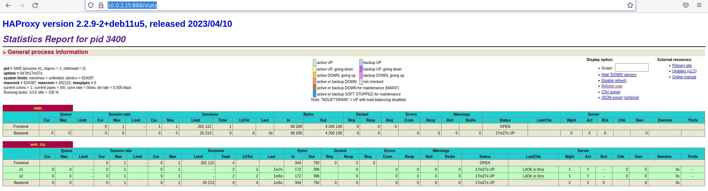
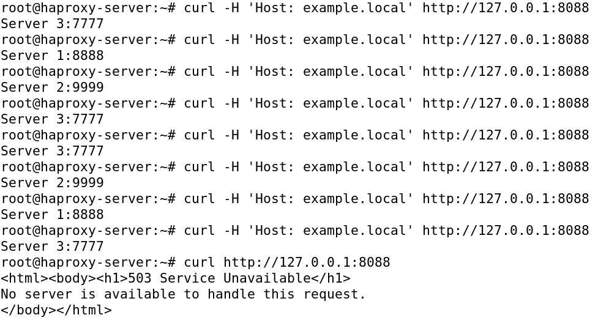
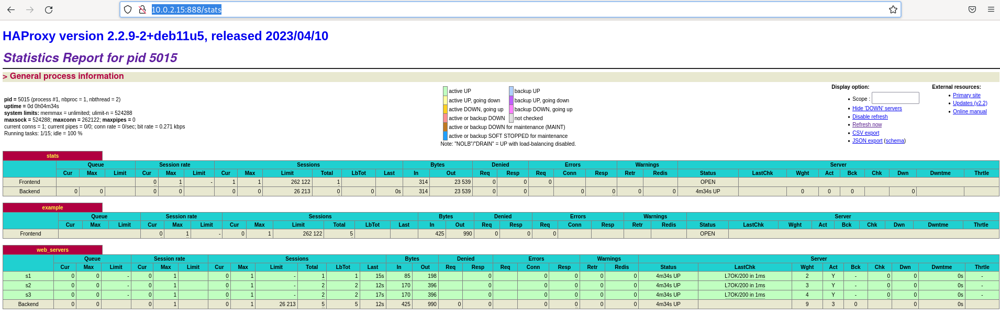

# hw_10-2_haproxy
HW_10-2_Кластаризация и балансировка нагрузки

# Домашнее задание к занятию 2 "Кластеризация и балансировка нагрузки"

### Задание 1

1. Запустить 2 simple python-сервера на ВМ на портах **:8888** и **:9999**:

```
mkdir http1 http2
cd http1
nano index.html
cd http2
nano index.html
```
<kbd></kbd>
<kbd></kbd>

Запускаем **Server 1** и **Server 2** в разных вкладках консоли:
```
mityaevg@haproxy-server:~/http1$ python3 -m http.server 8888 --bind 0.0.0.0
mityaevg@haproxy-server:~/http2$ python3 -m http.server 9999 --bind 0.0.0.0
```
<kbd></kbd>
<kbd></kbd>

2. Установим **HAProxy**:
```
sudo apt update && sudo apt install haproxy
```
3. Настройка балансировки **round-robin** на Layer 4 модели **OSI**:
```
root@haproxy-server:~#nano /etc/haproxy/haproxy.cfg nano /etc/haproxy/haproxy.cfg
```
В конфиг-файл добавим следующий разделы:
```
listen stats  # веб-страница со статистикой по адресу http://10.0.2.15:888/stats
       bind                    :888
       mode                    http
       stats                   enable
       stats uri               /stats
       stats refresh           5s
       stats realm             Haproxy\ Statistics

listen web_tcp # балансировка запросов на L4 OSI

        bind :1400

        server s1 127.0.0.1:8888 check inter 3s
        server s2 127.0.0.1:9999 check inter 3s
```
Перезапустим **haproxy.service**:
```
systemctl reload haproxy.service
```
Скриншот, отражающий перенаправление запросов на разные серверы:

<kbd></kbd>

Скриншот, отображающий статистику запросов через веб-интерфейс, доступный по адресу
**http://10.0.2.15:888/stats**:

<kbd></kbd>

### Задание 2

1. Подключим еще один simple python-сервер на порту **:7777**:
```
mkdir http3
cd http3
nano index.html
```
<kbd></kbd>

Запустим **Server 3** в отдельной вкладке консоли:
```
mityaevg@haproxy-server:~/http3$ python3 -m http.server 7777 --bind 0.0.0.0
```
<kbd></kbd>

2. Настроим балансировку **weighted round-robin** на Layer 7 модели **OSI** и вес для
каждого из серверов согласно заданию:
```
nano /etc/haproxy/haproxy.cfg
```
В конфиг-файл добавим следующий раздел:
```
backend web_servers    # секция бэкенд
        mode http # балансировка на L7 OSI
        balance roundrobin # Метод балансировки Round-robin
        option httpchk
        http-check send meth GET uri /index.html
        server s1 127.0.0.1:8888 weight 2 check # Вес 2 для Сервера 1
        server s2 127.0.0.1:9999 weight 3 check # Вес 3 для Сервера 2
        server s3 127.0.0.1:7777 weight 4 check # Вес 4 для Сервера 3
```

3. Настройка балансировки **только HTTP-трафика**, адресованного домену **example.local**:

```
frontend example  # секция фронтенд
        mode http
        bind :8088
        acl ACL_example.local hdr(host) -i example.local
        use_backend web_servers if ACL_example.local
```

4. Проверка работоспособности настроек, внесенных в конфигурационный файл:
```
curl -H 'Host: example.local' http://127.0.0.1:8088
```
Скриншот, отображающий перенаправление запросов на разные серверы при обращении к **HAProxy**:

<kbd></kbd>

Скриншот, отображающий статистику запросов через веб-интерфейс, доступный по адресу
**http://10.0.2.15:888/stats**:

<kbd></kbd>


